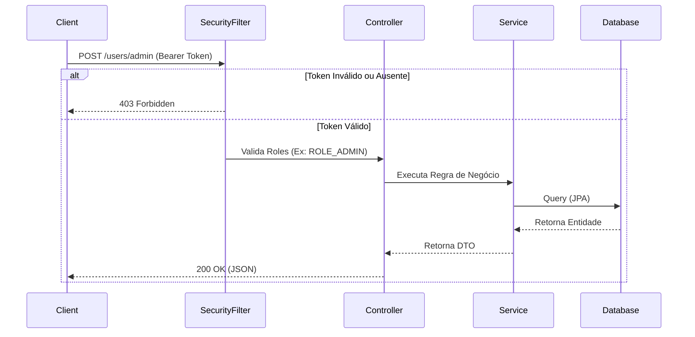

# 🛡️ Spring Boot Auth API

Uma API RESTful robusta desenvolvida em Java com Spring Boot, focada em segurança, autenticação e autorização utilizando **JSON Web Tokens (JWT)**. Este projeto implementa as melhores práticas de mercado para segurança de endpoints, arquitetura em camadas e tratamento global de exceções.

## 🚀 Tecnologias Utilizadas

* **Java 21+**
* **Spring Boot 4** (Web, Security, Data JPA, Validation)
* **Auth0 java-jwt:** Geração e validação de tokens JWT.
* **H2 Database:** Banco de dados em memória (ambiente de testes).

## 🏗️ Arquitetura do Sistema

O projeto segue a arquitetura de camadas (Controller-Service-Repository) com um filtro de segurança interceptando as requisições.



## 🔒 Funcionalidades Principais

* **Autenticação Segura:** Login devolvendo token JWT assinado digitalmente (Auth0).
* **RBAC (Role-Based Access Control):** Restrição de rotas baseada em níveis de acesso (`USER` e `ADMIN`).
* **Proteção contra Mass Assignment:** O payload de registro público é higienizado para forçar o nível `USER`, evitando o escalonamento de privilégios e injeção de roles indevidas.
* **Tratamento de Exceções Global:** Utilização de `@RestControllerAdvice` para interceptar erros 400 (Validação Jakarta) e 403 (Acesso Negado), devolvendo payloads JSON limpos e padronizados para o client.
* **Proteção de Segredos:** Variáveis de ambiente sensíveis (`JWT_SECRET`, `DB_PASSWORD`) injetadas via `.properties` externo, mantendo credenciais fora do histórico do Git.

## ⚙️ Como Executar o Projeto

```bash
git clone https://github.com/andrisgc/api-auth.git
cd api-auth
./mvnw spring-boot:run
```

Lembre-se de criar um `env.properties` com as seguintes variáveis:
```properties
DB_PASSWORD = senha_db
JWT_SECRET = chave_secreta
```

## 🛣️ Endpoints

| Método | Rota | Descrição | Acesso |
|---|---|---|---|
| `POST` | `/auth/register` | Cria uma nova conta (`ROLE_USER`) | Público |
| `POST` | `/auth/login` | Autentica usuário e devolve JWT | Público |
| `GET` | `/users/me` | Retorna dados do usuário logado | Autenticado |
| `GET` | `/users/admin` | Rota exclusiva para gestão administrativa | Apenas `ADMIN` |

## 🔮 Futuras Implementações (Roadmap)

- [ ] **Admin Seeder:** Implementar um `CommandLineRunner` para injetar o "Paciente Zero" (Administrador raiz) automaticamente na inicialização do banco de dados.
- [ ] **Configuração CORS:** Habilitar as políticas de compartilhamento de recursos (CORS) no Spring Security para permitir o consumo da API por um Front-end (React/Angular).
- [ ] **Migração para PostgreSQL:** Substituir o banco H2 em memória por um banco de dados relacional persistente para o ambiente de produção.
- [ ] **Documentação OpenAPI (Swagger):** Integrar a dependência SpringDoc para gerar a interface interativa de testes e documentação dos endpoints.
